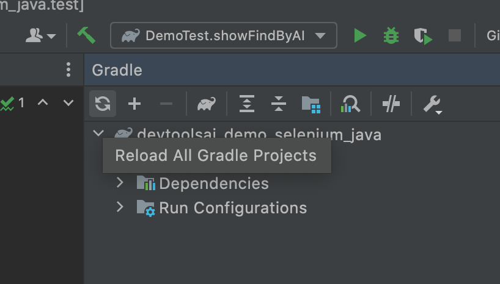
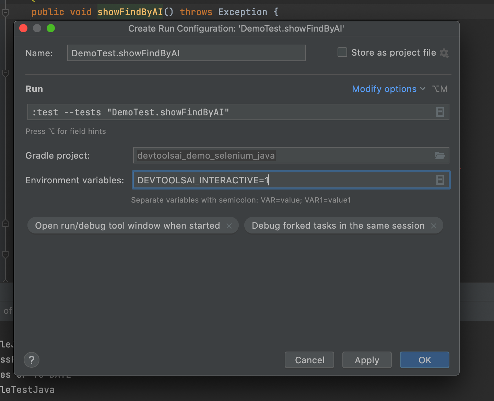

# devtoolsai_demo_selenium_python
Sample project showing how to use SmartDriver with Appium python.
The project is meant to be open with the IDE IntelliJ from JetBrains. If you use Eclipse or others you will have to adjust the instructions, particularly the env variable part.


# Setup
Open the project with IntelliJ

Trigger a gradle sync to install all the dependencies



## Appium
You also need to install and run Appium
```
npm install appium
appium
```

## Android
If you are using Android run the Android emulator with your own AVD
```
emulator -avd Pixel_4_API_29 # choose the AVD you created here
```

## iOS
You need to start the iOS simulator from Xcode, you can customize the emulator name in the script, but the default is 'iPhone 12 Pro Max' with iOS '14.4'

We provide a very basic sample ios .app file you can use. Otherwise you will need to get the .app or .ipa files for the apps you want to automate.


# Run the tests

There are two tests:
 - BasicCrawlAndroid, shows how to ingest an existing locator in the todoist app and then prompts to find the username text field  
 - BasicCrawlIOS, shows how to ingest an existing locator in the demo sample app and them prompts to click on the show alert button  

To fully experience this one, you need to enable an environment variable (DEVTOOLSAI_INTERACTIVE=1)
To do that, right click on the test() function name and click 'Modify run configuration', then input `DEVTOOLSAI_INTERACTIVE=1`



After that you can right click and click on 'Run test()', the test will run and you will be prompted to draw the box at some point.
